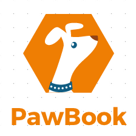

# P4 by Yixie Li (Claire)

##Live URL
<http://p4.snowyash.me>

##Description

**PawBook** is a convenient and portable minisite for pet owners to save their pet information online. Pet owners will no longer need to carry a piece of paper with pet vaccination record at all times, or look up the internet about their vet information when they are out with their pets anymore. PawBook is easy to register, add information, and refer to.

###Essential features:
* Register user information, with name and surname
* Add as many pets as you like
* Edit pet information, as well as input the latest vaccination and vet information
* Login and recall pet record on-the-go

##Demo

##Details for the teaching team

##Outside Code
* Twitter Bootstrap: <http://http://getbootstrap.com/2.3.2/>